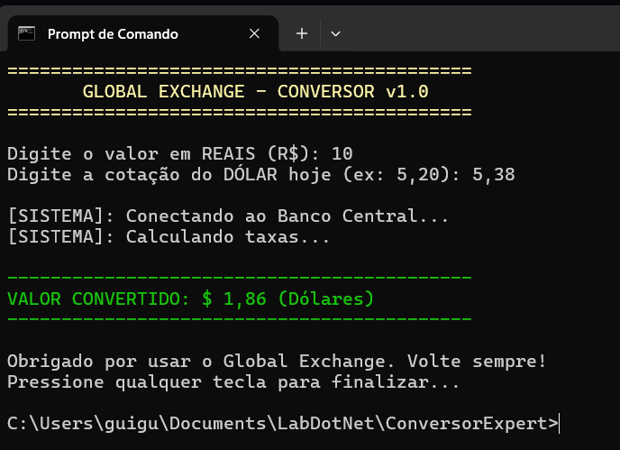

# una-ihcux-lista05
# ConversorExpert

Projeto desenvolvido em C# como atividade da Lista 05 de IHC e UX. O sistema simula um conversor de moedas no terminal, com foco em robustez, clareza na interação e melhor experiência para o usuário. :contentReference[oaicite:0]{index=0}

## Objetivo

O programa recebe um valor em reais e a cotação do dólar, realiza a conversão e exibe o resultado formatado no terminal. A proposta da atividade é aplicar conceitos de usabilidade e heurísticas de Nielsen em um sistema simples de console. :contentReference[oaicite:1]{index=1}

## Heurísticas aplicadas

**Visibilidade do status do sistema:** o programa exibe mensagens como “Conectando ao Banco Central...” e “Calculando taxas...”, mostrando ao usuário que a operação está em andamento. :contentReference[oaicite:2]{index=2}

**Prevenção de erros:** o uso de `try-catch` evita que o sistema feche de forma inesperada caso o usuário digite um valor inválido, exibindo uma mensagem de erro amigável. :contentReference[oaicite:3]{index=3}

**Estética e design minimalista:** a interface no terminal foi organizada de forma simples, com uso de cores, espaçamento e formatação do resultado final para facilitar a leitura. :contentReference[oaicite:4]{index=4}

## Estrutura do repositório

- `ConversorExpert/` → código-fonte completo do projeto  
- `evidencia-final.png` → print do sistema funcionando  
- `README.md` → resumo das heurísticas aplicadas :contentReference[oaicite:5]{index=5}

## Evidência

## Tecnologias utilizadas

- C#
- .NET Console Application
